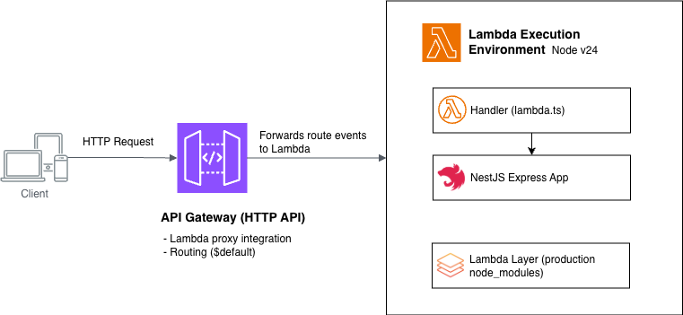

# NestJS on AWS Lambda with CDK

Reference implementation of a NestJS application running on AWS Lambda, using AWS CDK for infrastructure, HTTP API Gateway as the entry point, and GitHub Actions for CI/CD.

> Companion repository for the blog post **[A Practical Guide to Running Serverless NestJS on AWS Lambda with AWS CDK and GitHub Actions](https://deploy-preview-222--ajeetchaulagain.netlify.app/blog/nestjs-aws-serverless/)**.

## Architecture



A client sends an HTTP request to API Gateway, which forwards it to the Lambda function using proxy integration. The Lambda function bootstraps the NestJS application, with production dependencies resolved from the attached Lambda Layer.

## Stack

- **Runtime:** Node.js 24 / NestJS
- **Infrastructure:** AWS CDK (TypeScript)
- **API:** HTTP API Gateway (v2)
- **Lambda Layer:** Production `node_modules` separated from application code
- **CI/CD:** GitHub Actions

## Project Structure

```
├── src/                    # NestJS application source
│   ├── lambda.ts           # Lambda handler — adapts NestJS for Lambda execution model
│   └── main.ts             # Local development entry point
├── infra/                  # AWS CDK infrastructure (separate npm project)
│   ├── bin/infra.ts        # CDK app entry point
│   └── lib/infra-stack.ts  # Stack definition — Lambda, Layer, API Gateway
├── layer/                  # Lambda layer (gitignored, generated at build time)
│   └── nodejs/
│       └── node_modules/   # Production-only dependencies
└── .github/workflows/
    └── deploy.yml          # GitHub Actions deployment pipeline
```

## Prerequisites

- Node.js 24
- AWS CLI configured (`aws configure`)
- AWS CDK bootstrapped in your target account/region (`cdk bootstrap`)

## Getting Started

Install root dependencies and start the development server:

```bash
npm install
npm run start:dev
```

The application runs locally on `http://localhost:3000`.

> `infra/` is a separate npm project with its own `package.json`. Its dependencies are installed separately — see the deployment steps below.

## Build

Run the following before deploying:

```bash
# compile TypeScript → dist/
npm run build

# install production dependencies into layer/nodejs/node_modules/
npm run build:lambda-layer
```

## Deploying Locally

Before deploying, make sure your AWS credentials are configured locally. If you haven't set this up yet, the blog post covers the AWS CLI setup and CDK bootstrapping steps in detail.

```bash
aws configure
```

Install the CDK dependencies inside `infra/` — this is a separate npm project from the root and needs its own install:

```bash
cd infra && npm install
```

The stack is defined in `infra/lib/infra-stack.ts`. It provisions the Lambda function, attaches the Layer, and wires up HTTP API Gateway. Synthesize the CloudFormation template first to validate the stack without touching AWS:

```bash
npx cdk synth
```

Then deploy:

```bash
npx cdk deploy
```

After a successful deploy, the API URL is printed in the terminal:

```
Outputs:
InfraStack.HttpApiUrl = https://abc123.execute-api.us-east-1.amazonaws.com/
```

## Deploying via GitHub Actions

The workflow at `.github/workflows/deploy.yml` triggers automatically on push to `main` and on pull requests.

Add the following to your repository under **Settings → Secrets and variables → Actions**:

| Name                    | Type     | Description                          |
| ----------------------- | -------- | ------------------------------------ |
| `AWS_ACCESS_KEY_ID`     | Secret   | AWS IAM access key                   |
| `AWS_SECRET_ACCESS_KEY` | Secret   | AWS IAM secret key                   |
| `AWS_REGION`            | Variable | Target AWS region (e.g. `us-east-1`) |

> `AWS_REGION` is stored as a Variable rather than a Secret so it remains visible in workflow logs.

Once the workflow file is merged to `main`, pushes and pull requests will trigger the pipeline automatically.

## License

MIT
